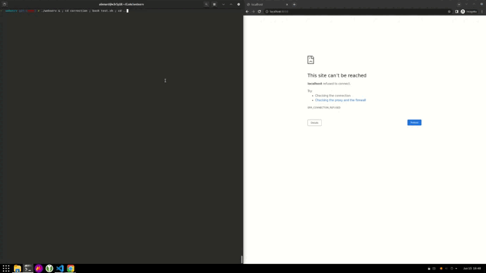

# webserv
a HTTP server in C++ 98

## demo
We tailored some scripts that demonstrated our server worked as intended

	

## context
this is a project form 42 Paris school's comon-core
it was coded by a team of three students : 
- [Pierre Cariou](https://github.com/pierrecariou) 
- [Damien Boyer](https://github.com/BoyerDamien) 
- [Alexandre Lienard](https://github.com/lienardale)

it was the first project where were more than two people, which obligated us to discover some good practices :
- git branches
- pull requests
- git actions
- minimum code review number before merging pull request 

## Languages and Tools:

 
For the correction scripts : 

To code the server :  

For the asynchronous team-work, pull-requests & git actions : 

To replicate the behavior of a production-grade server :  

To test our requests along the way :  

## features
- ### HTTP Requests
    * GET
    * POST
    * DELETE
- ### Configuration
    * location
    * server_name
    * ports
    * root / path
    * autoindex
- ### File Management
    * upload
    * download
    * mime_type
- ### CGI
    * php_cgi binary (php's cgi binary)
    * print_cgi (custom cgi binary for testing)
- ### error handling
    * max_bodysize
    * headers
    * sockets
    * custom error pages

## run it
- make sure the localhost ports you intend to use ard free
- "git clone && cd webserv"
- "make"
- "./webserv &" (add your own config file as a 2nd arg if you want, otherwise it will take the default one
- "cd correction && bash test.sh" (and explore the tests we prepared)
- go to http://localhost:8000/ in the navigator of your choice (to see a magnificent static website perfectly rendered)
- don't forget to kill the process once you've finished ("kill $(ps | grep webserv | cut -d " " -f 1)"
)